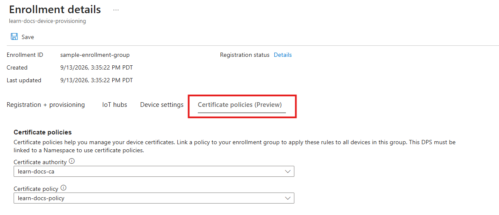
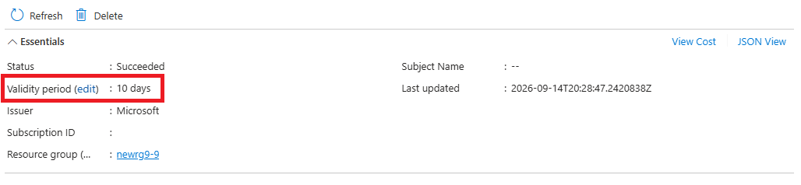

# Create or edit a certificate policy

The **certificate policy** defines the issuance characteristics of an intermediate certificate authority. Use a certificate policy to set the validity period for device certificates that the intermediate CA issues. Each intermediate certificate authority can have up to one certificate policy. 

Enrollments in Device Provisioning Service (DPS) reference certificate policies to determine which intermediate CA should issue the certificate and how the certificate is issued.

[!INCLUDE [iot-hub-public-preview-banner](../iot-hub/includes/public-preview-banner.md)]

## Prerequisites

Before you begin, ensure you have the required setup and permissions so you can create an intermediate CA and sign it with an external CA.

- An active Azure subscription. If you don't have one, create a [free account](https://azure.microsoft.com/pricing/purchase-options/azure-account?cid=msft_learn).
- An existing Device Registry namespace. For setup steps, see [Deploy Azure IoT Hub with ADR integration](../iot-hub/iot-hub-device-registry-setup.md).
- Permissions to manage policies in the Device Registry namespace, such as the [Azure Device Registry Credentials Contributor](../role-based-access-control/built-in-roles/internet-of-things.md#azure-device-registry-credentials-contributor) role.

# [Azure portal](#tab/portal)

<!-- TODO: Add portal content here. -->

## Create a certificate policy

1. On the **Certificate Authorities** page, select the intermediate certificate authority that you want to create a policy for.
1. Select **Create Policy**.
1. Enter a name for the policy.
1. Define the validity period for certificates issued by the intermediate certificate authority.
1. Select **Save**.

## Select a certificate policy in your DPS enrollment

1. Go to the **Device Provisioning Service** instance linked to this namespace.

1. Under **Settings**, select **Manage enrollments**.

1. Select your enrollment.

1. Under **Certificate policies**, select your intermediate certificate authority and then select your certificate policy.

   
   
1. Review the changes and then select **Save**.

## Edit the policy validity period

1. On the **Certificate Authorities** page, select the intermediate certificate authority you want.

1. Under **Certificate Policies**, select the certificate policy you want.

1. Select **edit** next to **Validity period**.

   
   
1. Change the validity period, and then select **Save**.

1. Refresh the page and verify that the new validity period appears.

# [Azure CLI](#tab/cli)

<!-- TODO: Add CLI content here. -->

## Prepare the Azure CLI

1. [Install Azure CLI](/cli/azure/install-azure-cli). To check the installed version, run `az version`. To install the latest version, run `az upgrade`.
1. Sign in to Azure by running `az login`.
1. Install the `azure-iot` extension when prompted on first use. To update an existing installation, run `az extension update --name azure-iot`.

### Set variables

Optionally, define variables for the commands in this article.


```azurecli
RG_NAME="<resource-group>"
NS_NAME="<adr-namespace>"
VALIDITY_DAYS="<validity-in-days>"
```

## Create a certificate policy

Create a certificate policy under the intermediate CA. The validity period controls how long device certificates issued by the certificate authority remain valid and must be between 1 and 90 days.


```azurecli
az iot adr ns ca policy create \
  --name "<POLICY_NAME>" \
  --ca-name "<ICA_NAME>" \
  --ns "$NS_NAME" \
  --resource-group "$RG_NAME" \
  --subscription "$SUBSCRIPTION_ID" \
  --location "<LOCATION>" \
  --validity-days "$VALIDITY_DAYS"
```

Verify the certificate policy properties:


```azurecli
az iot adr ns ca policy show \
  --name "<POLICY_NAME>" \
  --ca-name "<ICA_NAME>" \
  --ns "$NS_NAME" \
  --resource-group "$RG_NAME" \
  --subscription "$SUBSCRIPTION_ID" \
  --output table
```

## Select a certificate policy in your DPS enrollment

In your Device Provisioning Service, create or update an enrollment to reference your certificate authority and certificate policy. 

The following example creates a new enrollment group:


```azurecli
az iot dps enrollment-group create `
  --dps-name "<dps_name>" `
  --resource-group "<resource_group>" `
  --subscription "<subscription_id>" `
  --auth-type key `
  --enrollment-id "<enrollment_group_id>" `
  --allocation-policy hashed `
  --adr-namespace "<namespace_name>" `
  --adr-ca-name "<certificate_authority_name>" `
  --adr-cert-policy-name "<certificate_policy_name>"
```

The following example updates an existing enrollment group:


```azurecli
az iot dps enrollment-group update `
  --dps-name "<dps_name>" `
  --resource-group "<resource_group>" `
  --subscription "<subscription_id>" `
  --auth-type key `
  --enrollment-id "<enrollment_group_id>" `
  --adr-namespace "<namespace_name>" `
  --adr-ca-name "<certificate_authority_name>" `
  --adr-cert-policy-name "<certificate_policy_name>"

```

## Edit the certificate policy validity period

Update the policy to change the validity period for newly issued device certificates. The following example changes the device certificate validity period to 10 days:


```azurecli

az iot adr ns ca policy update \
  --name "<POLICY_NAME>" \
  --ca-name "<ICA_NAME>" \
  --ns "$NS_NAME" \
  --resource-group "$RG_NAME" \
  --subscription "$SUBSCRIPTION_ID" \
  --validity-days "10"

```

Confirm the updated validity period:


```azurecli
az iot adr ns ca policy show \
  --name "<POLICY_NAME>" \
  --ca-name "<ICA_NAME>" \
  --ns "$NS_NAME" \
  --resource-group "$RG_NAME" \
  --subscription "$SUBSCRIPTION_ID" \
  --output table
```

---

## Next steps

[Certificate management overview](iot-certificate-management-overview.md)
