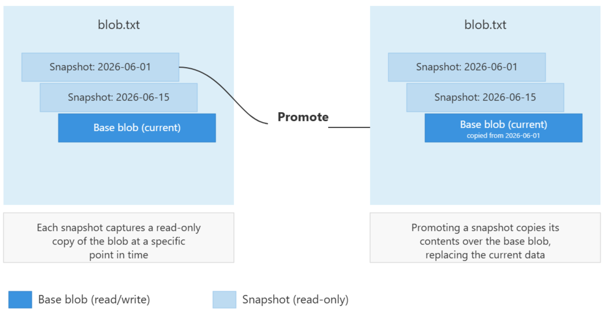

# Blob snapshots

A snapshot is a read-only copy of a blob taken at a specific point in time. You don't need to enable the blob snapshots feature. Instead, create snapshots on demand by using the `Snapshot Blob` operation. For more information, see **[Snapshot Blob Operation](/rest/api/storageservices/snapshot-blob)**. You can automate snapshot creation by using custom scripts to capture point-in-time copies of blobs on a schedule or before or after specific operations.

## Recommended data protection configuration

Blob snapshots are one of several data protection features. Choosing the right feature or combination of features depends on your workload and what you're protecting against. To learn more about Microsoft's recommendations for data protection, see [Data Protection Overview](./data-protection-overview.md).

### Snapshots versus versions

A snapshot is similar to a blob version, but the two differ in how they're created and what they're best suited for. A snapshot is manual and application-driven: you explicitly create a point-in-time copy when your application decides one is needed. A version is automatic and system-managed: Azure Storage creates a new version on every write or delete when blob versioning is enabled, with no application logic required.

Use versioning when you want automatic, continuous protection against accidental or malicious overwrites and deletes. Use snapshots when you want deliberate, point-in-time copies, such as a known-good checkpoint before a planned update, rather than a capture of every change.

> [!NOTE]
> Although you can approximate versioning behavior by using snapshots, Microsoft recommends blob versioning for automatic overwrite and delete protection on FNS accounts. Snapshots are best suited for deliberate, point-in-time captures rather than protection that captures every change. For more information, see **[Blob versioning](/azure/storage/blobs/versioning-overview)**.

## How snapshots work

A snapshot of a blob is identical to its base blob, except that the blob URI has a **DateTime** value appended to the blob URI to indicate the time when the snapshot was taken. For example, if a page blob URI is `http://storagesample.core.blob.windows.net/mydrives/myvhd`, the snapshot URI is similar to `http://storagesample.core.blob.windows.net/mydrives/myvhd?snapshot=2011-03-09T01:42:34.9360000Z`.

When you create a snapshot of a blob, the blob's system properties are copied to the snapshot with the same values. The base blob's metadata is also copied to the snapshot, unless you specify separate metadata for the snapshot when you create it. After you create a snapshot, you can read, copy, or delete it, but you can't modify it. Any leases associated with the base blob don't affect the snapshot. You can't acquire a lease on a snapshot.

A blob can have any number of snapshots. Snapshots persist until you explicitly delete them, either independently or as part of a **Delete Blob** operation for the base blob. You can create a snapshot of a blob in the hot, cold, or cool tier. You can't create a snapshot of an archived blob. 

> [!IMPORTANT]
> Having a large number of snapshots per blob can increase the latency for blob listing operations. Microsoft recommends maintaining fewer than 1,000 snapshots per blob. You can use lifecycle management to automatically delete old snapshots. For more information about lifecycle management, see **[Optimize costs by automating Azure Blob Storage access tiers](/azure/storage/blobs/lifecycle-management-overview)**. 

Snapshots are especially useful for blob types and operations that aren't captured by blob versioning. Because some write operations, such as **Put Page** (page blobs) and **Append Block** (append blobs), don't create blob versions even when versioning is enabled, snapshots provide a way to capture the point-in-time state of a blob when using these APIs. For example, a VHD file stores the current information and status for a VM disk. You can detach a disk from within the VM or shut down the VM, take a snapshot of its VHD file, and later use that snapshot to retrieve the VHD file at that point in time and recreate the VM.

The following diagram shows how snapshots are created, and how a snapshot might be promoted to be the current blob: 



### Manage and restore snapshots

You can create, list, and delete snapshots. You can also use a snapshot to restore a base blob to an earlier state. The following sections describe each operation and the corresponding tools.

#### Restore a blob from a snapshot

Because you can't modify a snapshot, you restore a base blob by copying a snapshot over it. Call the **Copy Blob** operation and specify the snapshot URI as the copy source. This process promotes the snapshot's state to become the current base blob, while preserving the blob's existing snapshots.

#### List snapshots

You can enumerate the snapshots associated with the base blob to track your current snapshots by using the List Blobs operation and specifying the `snapshots` value in the `include` parameter. By default, a list blobs request doesn't return snapshots. Set `include=snapshots` to return all snapshots for each blob alongside the base blob. For more information, see **[List Blobs](/rest/api/storageservices/list-blobs?tabs=microsoft-entra-id)**. You can also use Azure Storage blob inventory to generate a scheduled report of the blobs in your account, including their snapshots, by setting the `includeSnapshots` field to `true` in the inventory rule definition. For more information, see **[Blob Inventory](/azure/storage/blobs/blob-inventory)**.

#### Delete snapshots

You must delete a snapshot explicitly. To delete an individual snapshot, call the **Delete Blob** operation and specify the snapshot's DateTime value in the snapshot query parameter.

You can't delete a base blob while it has active snapshots. To delete a base blob and all of its snapshots together, call **Delete Blob** with the `x-ms-delete-snapshots` header set to `include`. To delete only the snapshots and keep the base blob, set the header to `only`.

#### Manage snapshots with tools

You can manage snapshots by using the portal, Azure CLI, and Azure PowerShell. 

### [Portal](#tab/azure-portal)

To create a snapshot of a blob by using the Azure portal, follow these steps:

1. In the [Azure portal](https://portal.azure.com/), navigate to your storage account.
1. Under **Data storage**, find the **Containers** option, and then select the container that holds the blob.
1. Select the blob that you want to snapshot.
1. On the blob's **Overview** tab, select **Create snapshot**.
1. To view the snapshots for the blob, select the **Snapshots** tab. The tab lists each snapshot along with the date and time it was captured.

### [PowerShell](#tab/azure-powershell)

To create a snapshot of a blob with PowerShell, first get a reference to the blob by calling the [Get-AzStorageBlob](/powershell/module/az.storage/get-azstorageblob) command, and then call the **Snapshot** method on the blob.

The following example creates a snapshot of a blob. Replace the placeholder values in brackets with your own values:

```azurepowershell
$ctx = New-AzStorageContext -StorageAccountName <storage-account> -UseConnectedAccount

$blob = Get-AzStorageBlob -Container <container> `
    -Blob <blob> `
    -Context $ctx

$snapshot = $blob.ICloudBlob.Snapshot()
$snapshot.SnapshotTime
```

To list the snapshots of a blob, call the **ListBlobs** method on the blob's container, specifying the **Snapshots** listing option:

```azurepowershell
$blob.ICloudBlob.Container.ListBlobs(<blob>, $true, "Snapshots")
```

### [Azure CLI](#tab/azure-CLI)

To create a snapshot of a blob with Azure CLI, call the [az storage blob snapshot](/cli/azure/storage/blob#az-storage-blob-snapshot) command.

The following example creates a snapshot of a blob. Replace the placeholder values in brackets with your own values:

```azurecli-interactive
az storage blob snapshot --account-name <storage-account> \
    --container-name <container> \
    --name <blob> \
    --auth-mode login
```

To list the snapshots of a blob, call the [az storage blob list](/cli/azure/storage/blob#az-storage-blob-list) command and include snapshots in the results:

```azurecli-interactive
az storage blob list --account-name <storage-account> \
    --container-name <container> \
    --prefix <blob> \
    --include s \
    --auth-mode login
```

---

## Feature support

This feature isn't enabled for Data Lake Storage Gen2 accounts. Additionally, Network File System (NFS) 3.0 protocol, or the SSH File Transfer Protocol (SFTP) might impact support for this feature. If you enable any of these capabilities, see [Blob Storage feature support in Azure Storage accounts](/editor/MicrosoftDocs/azure-docs-pr/articles%2Fstorage%2Fblobs%2Fsnapshots-overview.md/pr/includes/azure-storage-feature-support.md) to assess support for this feature. Consider alternative mechanisms. Examples include **[Soft delete for blobs](/azure/storage/blobs/soft-delete-blob-overview)**, **[AzCopy](/azure/storage/common/storage-use-azcopy-v10?tabs=dnf)**, and **[Vaulted Backup](/azure/backup/azure-data-lake-storage-backup-overview)**.

## Feature interactions

#### Versioning

When you enable versioning, snapshots are usually redundant for block blobs. If you enable both versioning and snapshots at the same time, taking a snapshot creates both a snapshot and a new version. This process increases the number of stored objects without adding protection. For more information, see [Blob versioning](versioning-overview.md).

#### Soft delete

Soft delete applies to snapshots: when you delete a snapshot, it becomes soft-deleted. You can restore it during the retention period by using Undelete Blob. Additionally, the way you create and bill for snapshots differs depending on whether versioning is enabled. When versioning is disabled, overwriting a blob creates a soft-delete snapshot. When versioning is enabled, it creates a new version instead. If you explicitly set the tier on a base blob, you pay full content length for any previous versions or snapshots of the soft-deleted blob. For details on this billing behavior, see the Pricing and billing section. For more information on soft delete, see [Blob Soft Delete](soft-delete-blob-overview.md).

#### Object replication

You can't replicate snapshots. Only the base blob is replicated. For more information, see [Object Replication](object-replication-overview.md).

#### Lifecycle management

Lifecycle management can target and delete snapshots by using the snapshot subtype in policy rules. For more information, see [Lifecycle Management](lifecycle-management-overview.md).

## Pricing and billing

Creating a snapshot, which is a read-only copy of a blob, can result in extra data storage charges to your account. When designing your application, be aware of how these charges might accrue so that you can minimize costs.

Blob snapshots, like blob versions, are billed at the same rate as active data. How you are billed for snapshots depends on whether you explicitly set the tier for the base blob or for any of its snapshots (or versions). For more information about blob tiers, see [Access tiers for blob data](access-tiers-overview.md).

If you don't change a blob or snapshot's tier, you're billed for unique blocks of data across that blob, its snapshots, and any versions it might have. For more information, see [Billing when the blob tier hasn't been explicitly set](#billing-when-you-dont-explicitly-set-the-blob-tier).

If you change a blob or snapshot's tier, you're billed for the entire object, regardless of whether the blob and snapshot are eventually in the same tier again. For more information, see [Billing when the blob tier has been explicitly set](#billing-when-you-dont-explicitly-set-the-blob-tier).

For storage accounts that leverage smart tier, versions and snapshots are billed at full content length. For more information, see [Optimize costs with smart tier](access-tiers-smart.md).

For more information about billing details for blob versions, see [Blob versioning](versioning-overview.md).

### Minimize costs with snapshot management

To avoid extra charges, manage your snapshots carefully. Follow these best practices to help minimize the costs incurred by the storage of your snapshots:

- Delete and re-create snapshots associated with a blob whenever you update the blob, even if you're updating with identical data, unless your application design requires that you maintain snapshots. By deleting and re-creating the blob's snapshots, you ensure that the blob and snapshots don't diverge.
- If you're maintaining snapshots for a blob, avoid calling methods that overwrite the entire blob when you update the blob. Instead, update the fewest possible number of blocks to keep costs low.

### Billing when you don't explicitly set the blob tier

If you don't explicitly set the blob tier for a base blob or any of its snapshots, you pay for unique blocks or pages across the blob, its snapshots, and any versions it might have. You pay for data that a blob and its snapshots share only once. When you update a blob, data in a base blob diverges from the data stored in its snapshots, and you pay for unique data per block or page.

When you replace a block within a block blob, you later pay for that block as a unique block. This rule applies even if the block has the same block ID and the same data as it has in the snapshot. After you commit the block again, it diverges from its counterpart in the snapshot, and you pay for its data. The same rule applies to a page in a page blob that's updated with identical data.

Blob storage doesn't have a way to determine whether two blocks contain identical data. Each block that you upload and commit is treated as unique, even if it has the same data and the same block ID. Because you pay for unique blocks, remember that updating a blob when that blob has snapshots or versions results in extra unique blocks and extra charges.

When a blob has snapshots, call update operations on block blobs so that they update the least possible number of blocks. The write operations that permit fine-grained control over blocks are [Put Block](/rest/api/storageservices/put-block) and [Put Block List](/rest/api/storageservices/put-block-list). The [Put Blob](/rest/api/storageservices/put-blob) operation, on the other hand, replaces the entire contents of a blob and so might lead to extra charges.

The following scenarios demonstrate how charges accrue for a block blob and its snapshots when you don't explicitly set the blob tier.

#### Scenario 1

In scenario 1, the base blob hasn't been updated after the snapshot was taken, so charges are incurred only for unique blocks 1, 2, and 3.


#### Scenario 2

In scenario 2, the base blob has been updated, but the snapshot hasn't. Block 3 was updated, and even though it contains the same data and the same ID, it isn't the same as block 3 in the snapshot. As a result, the account is charged for four blocks.


#### Scenario 3

In scenario 3, the base blob has been updated, but the snapshot hasn't. Block 3 was replaced with block 4 in the base blob, but the snapshot still reflects block 3. As a result, the account is charged for four blocks.


#### Scenario 4

In scenario 4, the base blob has been completely updated and contains none of its original blocks. As a result, the account is charged for all eight unique blocks.


> [!TIP]
> To keep costs low, avoid calling methods that overwrite the entire blob. Instead, update individual blocks.

### Billing when you explicitly set the blob tier

If you explicitly set the blob tier for a blob, snapshot, or version, you pay for the full content length of the object in the new tier, regardless of whether it shares blocks with an object in the original tier. You also pay for the full content length of the oldest version in the original tier. You pay for unique blocks in any versions or snapshots that remain in the original tier, as described in [Billing when the blob tier isn't explicitly set](#billing-when-you-dont-explicitly-set-the-blob-tier).

#### Moving a blob to a new tier

The following table describes the billing behavior for a blob or snapshot when you move it to a new tier.

| When you explicitly set the blob tier on... | Then you're billed for... |
|-|-|
| A base blob with a snapshot | The base blob in the new tier and the oldest snapshot in the original tier, plus any unique blocks in other snapshots.<sup>1</sup> |
| A base blob with a previous version and a snapshot | The base blob in the new tier, the oldest version in the original tier, and the oldest snapshot in the original tier, plus any unique blocks in other versions or snapshots.<sup>1</sup> |
| A snapshot | The snapshot in the new tier and the base blob in the original tier, plus any unique blocks in other snapshots.<sup>1</sup> |

<sup>1</sup>If there are other previous versions or snapshots that you didn't move from their original tier, you pay based on the number of unique blocks they contain, as described in [Billing when the blob tier isn't explicitly set](#billing-when-you-dont-explicitly-set-the-blob-tier).

The following diagram illustrates how objects are billed when you move a blob with snapshots to a different tier.

:::image type="content" source="media/snapshots-overview/snapshot-billing-tiers.png" alt-text="Diagram showing how objects are billed when a blob with snapshots is explicitly tiered.":::

You can't undo explicitly setting the tier for a blob, version, or snapshot. If you move a blob to a new tier and then move it back to its original tier, you pay for the full content length of the object even if it shares blocks with other objects in the original tier.

Operations that explicitly set the tier of a blob, version, or snapshot include:

- [Set Blob Tier](/rest/api/storageservices/set-blob-tier)

- [Put Blob](/rest/api/storageservices/put-blob) with tier specified
- [Put Block List](/rest/api/storageservices/put-block-list) with tier specified
- [Copy Blob](/rest/api/storageservices/copy-blob) with tier specified

#### Deleting a blob when soft delete is enabled

When blob soft delete is enabled, if you delete or overwrite a base blob that you explicitly set the tier for, you pay for the full content length of any previous versions or snapshots of the soft-deleted blob. For more information about how blob versioning and soft delete work together, see [Feature interactions](versioning-overview.md#feature-interactions).

The following table describes the billing behavior for a blob that is soft-deleted, depending on whether versioning is enabled or disabled. When versioning is enabled, a new version is created when a blob is soft-deleted. When versioning is disabled, soft-deleting a blob creates a soft-delete snapshot.

| When you overwrite a base blob with its tier explicitly set... | Then you're billed for... |
|-|-|
| If blob soft delete and versioning are both enabled | All existing versions at full content length regardless of tier. |
| If blob soft delete is enabled but versioning is disabled | All existing soft-delete snapshots at full content length regardless of tier. |

## Known limitations

- You can't create snapshots for blobs in the archive access tier. 

- Data Lake Gen2 account snapshot support no longer accepts new customers. Instead, use blob soft delete, AzCopy, or Vaulted Backup. 

- You can't delete a blob while it has active snapshots unless you include `x-ms-delete-snapshots` in the delete call. 

- Object replication doesn't replicate snapshots. 

- You can't modify snapshots after creation.

- You can't acquire a lease on a snapshot.

## Monitoring and troubleshooting

- I can't delete my base blob: The blob has active snapshots. Use **Delete Blob** with `x-ms-delete-snapshots: include` to delete both simultaneously. 

- My snapshot disappeared after I deleted the base blob: Deleting the base blob permanently deletes snapshots unless blob soft delete is enabled. Enable soft delete to protect against accidental deletion. 

- My snapshot costs are higher than expected: If you explicitly change the blob's access tier, you pay for full content length rather than unique blocks only. Avoid explicit tier changes on blobs with active snapshots where possible. 

- Viewing and inventorying snapshots: In the portal, snapshots appear under the blob in Storage Browser when **Show blob snapshots** is enabled. To inventory snapshot count and storage usage across an account, use Azure Storage Blob Inventory and the BlobCapacity metric in Azure Monitor.

## Next steps

- [Blob versioning](versioning-overview.md)

- [Create and manage a blob snapshot in .NET](snapshots-manage-dotnet.md)

- [Back up Azure unmanaged VM disks with incremental snapshots](/azure/virtual-machines/windows/incremental-snapshots)

