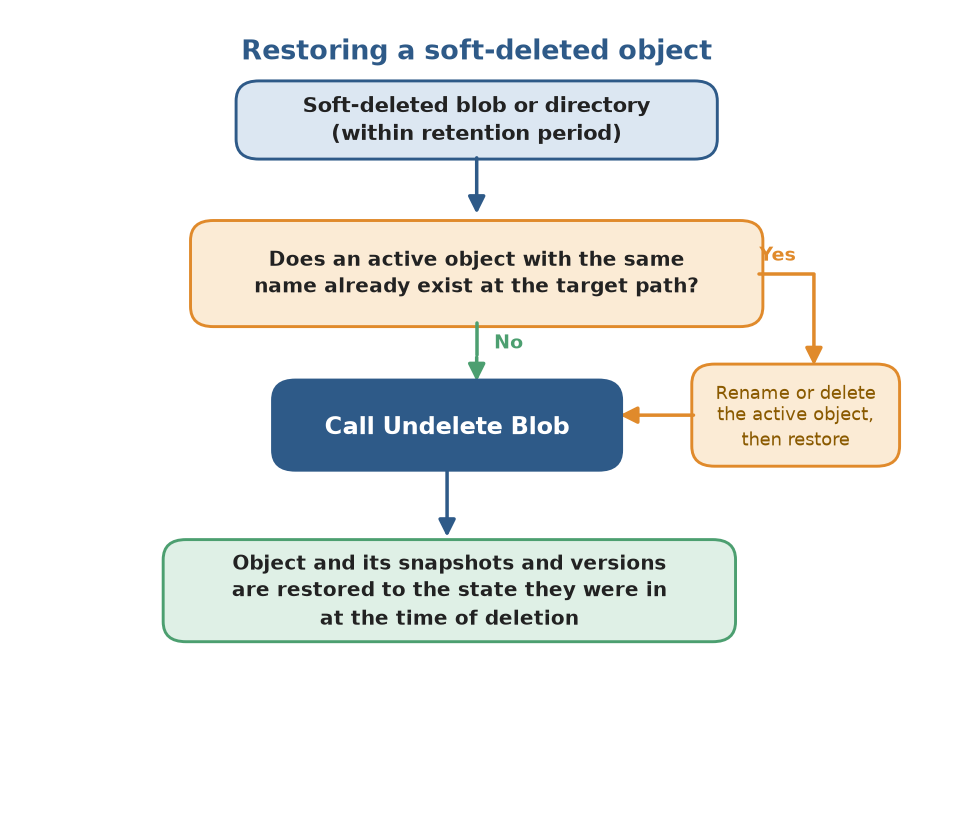
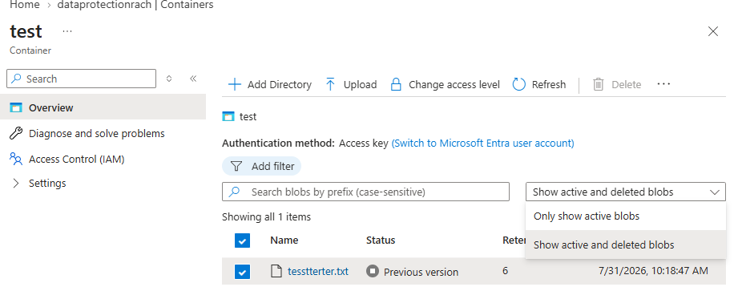

# Soft delete for blobs

Blob soft delete protects an individual blob, snapshot, or version from accidental deletes or overwrites by keeping the deleted data in the system for a specified period of time. During the retention period, you can restore a soft-deleted object to its state at the time it was deleted. After the retention period expires, the object is permanently deleted.

## Recommended data protection configuration

Blob soft delete is part of a comprehensive in-account data protection strategy for blob data. For optimal protection of your blob data, Microsoft recommends enabling the following data protection features:

- Blob soft delete, to restore a blob, snapshot, or version that you deleted. To learn how to enable blob soft delete, see [Enable and manage soft delete for blobs](soft-delete-blob-enable.md).

- Container soft delete, to restore a container that you deleted. To learn how to enable container soft delete, see [Enable and manage soft delete for containers](soft-delete-container-enable.md).

For protection against broader data loss scenarios such as accidental account deletion or ransomware, consider enabling Azure Backup in addition to in-account features. To learn more about Microsoft's recommendations for data protection, see [Data protection overview](data-protection-overview.md).

> [!TIP]
> To enable blob and container soft delete at scale, use the built-in Azure Policy [Configure soft delete for blobs and containers on storage accounts](https://portal.azure.com/#view/Microsoft_Azure_Policy/PolicyDetail.ReactView/id/%2Fproviders%2FMicrosoft.Authorization%2FpolicyDefinitions%2F9fbd64e3-67b8-489b-98e5-fa0007d17e76).

## How blob soft delete works

When you enable blob soft delete for a storage account, specify a retention period for deleted objects between 1 and 365 days. The retention period indicates how long the data remains available after it's deleted or overwritten. As soon as an object is deleted or overwritten, the retention period expiration time is set. 

While the retention period is active, you can restore a deleted blob, together with its snapshots and versions by calling the [Undelete Blob](/rest/api/storageservices/undelete-blob) operation. The following diagram shows how a deleted object can be restored when blob soft delete is enabled:

:::image type="content" source="media/soft-delete-blob-overview/blob-soft-delete-diagram.png" alt-text="Screenshot of how a soft-deleted blob can be restored during the retention period.":::

You can update the configured retention period at any time. 

If you disable blob soft delete, you can continue to access and recover soft-deleted objects in your storage account until the soft delete retention period elapses.

Version 2017-07-29 and higher of the Azure Storage REST API supports blob soft delete.

> [!IMPORTANT]
> You can use blob soft delete only to restore an individual blob or directory (in a hierarchical namespace) and all of their associated snapshots and versions (only in flat-namespace). To restore a container and its contents, you must also enable container soft delete for the storage account. 
> 
> Blob soft delete doesn't protect at a container or account level. Reference [Data Protection Overview](data-protection-overview.md) for recommendations on protection based on your workload. 

### How deletions are handled when soft delete is enabled

When you enable blob soft delete, deleting a blob marks that blob as soft-deleted. The deletion process doesn't create a snapshot. When the retention period expires, the system permanently deletes the soft-deleted blob. In accounts that have a hierarchical namespace, the access control list of a blob remains intact if the blob is restored.

If a blob has snapshots, you can't delete the blob unless you also delete the snapshots. When you delete a blob and its snapshots, both the blob and snapshots are marked as soft-deleted. The deletion process doesn't create new snapshots.

You can also delete one or more active snapshots without deleting the base blob. In this case, the snapshot is soft-deleted.

If you delete a directory in an account that has the hierarchical namespace feature enabled on it, the directory and all its contents are marked as soft-deleted. You can only access the soft-deleted directory. To access the contents of the soft-deleted directory, you need to undelete the soft-deleted directory.

Soft-deleted objects are invisible unless you explicitly display or list them. For more information about how to list soft-deleted objects, see [Manage and restore soft-deleted blobs](soft-delete-blob-manage.yml).

### How overwrites are handled when soft delete is enabled

> [!IMPORTANT]
> This section doesn't apply to accounts that have a hierarchical namespace.

Calling an operation such as [Put Blob](/rest/api/storageservices/put-blob), [Put Block List](/rest/api/storageservices/put-block-list), or [Copy Blob](/rest/api/storageservices/copy-blob) overwrites the data in a blob. When you enable blob soft delete, overwriting a blob automatically creates a soft-deleted snapshot of the blob's state prior to the write operation. When the retention period expires, the system permanently deletes the soft-deleted snapshot. The operation that the system performs to create the snapshot doesn't appear in Azure Monitor resource logs or Storage Analytics logs.

Soft-deleted snapshots are invisible unless you explicitly display or list soft-deleted objects. For more information about how to list soft-deleted objects, see [Manage and restore soft-deleted blobs](soft-delete-blob-manage.yml).

Blob soft delete doesn't protect against operations to write blob metadata or properties. No soft-deleted snapshot is created when a blob's metadata or properties are updated. To capture a blob's metadata, see [Blob versioning](#blob-versioning).

For premium storage accounts, soft-deleted snapshots don't count toward the per-blob limit of 100 snapshots.

### Restoring soft-deleted objects

You can restore soft-deleted blobs or directories (in a hierarchical namespace) by calling the [Undelete Blob](/rest/api/storageservices/undelete-blob) operation within the retention period. The **Undelete Blob** operation restores a blob and any soft-deleted snapshots or versions associated with it. It restores any snapshots that were deleted during the retention period. In accounts that have a hierarchical namespace, the access control list of a blob is restored along with the blob.

In accounts that have a hierarchical namespace, you can also use the **Undelete Blob** operation to restore a soft-deleted directory and all its contents. If you rename a directory that contains soft-deleted blobs, those soft-deleted blobs become disconnected from the directory. To restore those blobs, you need to revert the directory name to its original name or create a separate directory that uses the original directory name. Otherwise, you receive an error when you attempt to restore those soft-deleted blobs. You also can't restore a directory or a blob to a filepath that already has a directory or blob of that name. For example, if you delete `a.txt` (1) and upload a new file also named `a.txt` (2), you can't restore the soft-deleted `a.txt` (1) until the active `a.txt` (2) is either deleted or renamed. You can't access the contents of a soft-deleted directory until after the directory is undeleted.

Calling **Undelete Blob** on a blob that isn't soft-deleted will restore all soft-deleted snapshots that are associated with the blob. If the blob has no snapshots and isn't soft-deleted, then calling **Undelete Blob** has no effect.

To promote a soft-deleted snapshot to the base blob, first call **Undelete Blob** on the base blob to restore the blob and its snapshots. Next, copy the desired snapshot over the base blob. You can also copy the snapshot to a new blob.

You can't read data in a soft-deleted blob or snapshot until the object is restored.

For more information on how to restore soft-deleted objects, see [Manage and restore soft-deleted blobs](soft-delete-blob-manage.yml).

> [!TIP]
> To restore blobs at scale across multiple storage accounts based on a set of conditions that you define, use a _storage task_. A storage task is a resource available in _Azure Storage Actions_: a serverless framework that you can use to perform common data operations on millions of objects across multiple storage accounts. To learn more, see [What is Azure Storage Actions?](../../storage-actions/overview.md)
## Blob soft delete protection by operation

The following table describes the expected behavior for delete and write operations when blob soft delete is enabled, either with or without blob versioning. In the following tables, **No change** means the operation behaves the same whether or not blob soft delete is enabled.

### Storage account (no hierarchical namespace)

| REST API operations | Soft delete enabled | Soft delete and versioning enabled |
|--|--|--|
| [Delete Storage Account](/rest/api/storagerp/storageaccounts/delete) | No change. Containers and blobs in the deleted account aren't recoverable. | No change. Containers and blobs in the deleted account aren't recoverable. |
| [Delete Container](/rest/api/storageservices/delete-container) | No change. Blobs in the deleted container aren't recoverable unless [Container soft delete](#container-soft-delete) is enabled. | No change. Blobs in the deleted container aren't recoverable. |
| [Delete Blob](/rest/api/storageservices/delete-blob) | If used to delete a blob, the operation marks the blob as soft deleted.    If used to delete a blob snapshot, the operation marks the snapshot as soft deleted. | If used to delete a blob, the current version becomes a previous version, and the current version is deleted. The operation doesn't create a new version or soft-deleted snapshots.   If used to delete a blob version, the operation marks the version as soft deleted. |
| [Undelete Blob](/rest/api/storageservices/undelete-blob) | Restores a blob and any snapshots that were deleted within the retention period. | Restores a blob and any versions that were deleted within the retention period. |
| [Put Blob](/rest/api/storageservices/put-blob) [Put Block List](/rest/api/storageservices/put-block-list) [Copy Blob](/rest/api/storageservices/copy-blob) [Copy Blob from URL](/rest/api/storageservices/copy-blob) | If called on an active blob, the operation automatically generates a snapshot of the blob's state prior to the operation.    If called on a soft-deleted blob, the operation generates a snapshot of the blob's prior state only if it's being replaced by a blob of the same type. If the blob is of a different type, the operation permanently deletes all existing soft-deleted data. | The operation automatically generates a new version that captures the blob's state prior to the operation. |
| [Put Block](/rest/api/storageservices/put-block) | If used to commit a block to an active blob, there's no change.  If used to commit a block to a blob that is soft-deleted, the operation creates a new blob and automatically generates a snapshot to capture the state of the soft-deleted blob. | No change. |
| [Put Page](/rest/api/storageservices/put-page) [Put Page from URL](/rest/api/storageservices/put-page-from-url) | No change. Page blob data that the operation overwrites or clears isn't saved and isn't recoverable. | No change. Page blob data that the operation overwrites or clears isn't saved and isn't recoverable. |
| [Append Block](/rest/api/storageservices/append-block) [Append Block from URL](/rest/api/storageservices/append-block-from-url) | No change. | No change. |
| [Set Blob Properties](/rest/api/storageservices/set-blob-properties) | No change. Overwritten blob properties aren't recoverable. | No change. Overwritten blob properties aren't recoverable. |
| [Set Blob Metadata](/rest/api/storageservices/set-blob-metadata) | No change. Overwritten blob metadata isn't recoverable. | The operation automatically generates a new version that captures the blob's state prior to the operation. |
| [Set Blob Tier](/rest/api/storageservices/set-blob-tier) | The base blob is moved to the new tier. Any active or soft-deleted snapshots remain in the original tier. No soft-deleted snapshot is created. | The base blob is moved to the new tier. Any active or soft-deleted versions remain in the original tier. No new version is created. |

### Storage account (hierarchical namespace)

|**REST API operation**|**Soft delete enabled**|
|---|---|
|[Delete Storage Account](/rest/api/storagerp/storage-accounts/delete) | No change. Containers and blobs in the deleted account aren't recoverable. |
|[Filesystem - Delete](/rest/api/storageservices/datalakestoragegen2/filesystem/delete) | No change. Blobs in the deleted container aren't recoverable.|
|[Delete Container](/rest/api/storageservices/delete-container) |No change. Blobs in the deleted container aren't recoverable unless [Container soft delete](#container-soft-delete) is enabled.|
|[Path - Delete](/rest/api/storageservices/datalakestoragegen2/path/delete) | The operation creates a soft-deleted blob or directory. The soft-deleted object is deleted after the retention period.|
|[Delete Blob](/rest/api/storageservices/delete-blob)|The operation creates a soft-deleted object. The soft-deleted object is deleted after the retention period. You cannot delete a blob with existing snapshots.|
|[Path - Create](/rest/api/storageservices/datalakestoragegen2/path/create) that renames a blob or directory | The existing destination blob or empty directory is soft-deleted and the source replaces it. The soft-deleted object is deleted after the retention period.|
|[Set Blob Expiry](/rest/api/storageservices/set-blob-expiry) that sets an expiration date on an existing blob | No change. An expired blob doesn't become a soft-deleted blob when it expires. |

## Feature support

[!INCLUDE [Blob Storage feature support in Azure Storage accounts](../../../includes/azure-storage-feature-support.md)]

## Workload considerations

Enabling soft delete doesn't impact your existing data, but it changes the behavior of delete and overwrite operations. Before enabling soft delete on a production workload, consider the following factors: 

- **Listing all blobs now returns soft-deleted blobs.** This change has the highest impact. Applications that list blobs with an all flag (`BlobListingDetails.All` in legacy SDKs, or `BlobStates.All` in the v12 `Azure.Storage.Blobs` SDK) start receiving soft-deleted blobs once you enable soft delete. Application logic that assumes only active blobs are returned can misbehave, and backup or restore processes can misinterpret soft-deleted blobs as active data. Audit your code for all listing flags and test before enabling. To list only active blobs, use `BlobStates.None`. To list versions while excluding soft-deleted blobs, use `BlobStates.Versioned`.

- **Deletes and overwrites now retain data and continue to bill.** When you enable soft delete, deleting or overwriting a blob doesn't immediately free space. The prior state is retained as soft-deleted data and billed at the same rate as active data until the retention period elapses. Workloads that rely on delete or overwrite operations to reclaim storage incur additional cost for the length of the retention period.

- **Overwrite-heavy workloads accumulate soft-deleted snapshots.** On FNS accounts, if versioning isn't enabled, each overwrite creates a soft-deleted snapshot that captures the prior state. Applications that frequently overwrite the same blobs, such as logging, checkpointing, or temp files, can generate large volumes of soft-deleted data and unexpected cost. If you haven't changed a blob or snapshot's tier, then you're billed for unique blocks of data across that blob, its snapshots, and any versions it may have. See snapshots [Pricing and Billing](/azure/storage/blobs/snapshots-overview?branch=main). Choose a retention period that reflects your recovery needs without over-retaining churn.

- **Blocks the DFS endpoint on flat-namespace accounts.** When you enable soft delete on an account without a hierarchical namespace, operations through the Data Lake Storage (DFS) endpoint (`*.dfs.core.windows.net`) are blocked and fail with `EndpointUnsupportedAccountFeatures`. Use the Blob endpoint (`*.blob.core.windows.net`) instead, or upgrade the account to a hierarchical namespace to use DFS endpoints with soft delete enabled.

## Feature interactions

#### Blob versioning

> [!IMPORTANT]
> Hierarchical namespace isn't supported for versioning.

- **Overwrites create a version instead of a soft-deleted snapshot:** If you enable both blob versioning and blob soft delete, overwriting a blob creates a new previous version that captures the blob's prior state. The operation doesn't create a soft-deleted snapshot. The new version isn't soft-deleted and isn't removed when the soft-delete retention period expires.

- **Deleting a previous version soft-deletes only that version:** Deleting a specific *previous* *version*, soft-deletes that version, which is retained until the soft-delete retention period elapses. After the retention period elapses, the soft-deleted version is permanently deleted.

- **Undelete restores all soft-deleted versions:** The Undelete Blob operation restores all soft-deleted versions of a blob at once; you can't selectively restore one. It doesn't promote any version to current. To restore the current version, undelete first, then copy the desired previous version over the base blob. For more information, see [Feature interactions](versioning-overview.md#feature-interactions).

#### Blob snapshots

- **Overwrites create a soft-deleted snapshot when versioning is disabled:** On a flat-namespace account without versioning, overwriting a blob automatically generates a soft-deleted snapshot that captures the blob's state before the write. When the retention period expires, the snapshot is permanently deleted.

- **Soft delete protects snapshots you delete explicitly:** Deleting an active snapshot soft-deletes it, and it retains for the retention period. You can't delete a base blob that has snapshots unless you delete its snapshots too. When you delete both, you mark all as soft-deleted.

- **Premium accounts don't count soft-deleted snapshots toward the snapshot limit:** On premium block blob accounts, soft-deleted snapshots don't count toward the per-blob limit of 100 snapshots.

#### Lifecycle management

- **Lifecycle delete actions produce soft-deleted objects:** When a lifecycle management policy deletes a blob, snapshot, or version, soft delete still applies. The deleted object moves to the soft-deleted state and remains recoverable for the retention period rather than being removed immediately. If you use lifecycle rules to control storage growth, account for the additional retention window, since deleted data continues to bill until the retention period elapses.

#### Permanent delete

- **Permanent delete overrides soft-delete retention on snapshots and versions:** If you enable the permanent delete feature on the account, a caller with the appropriate permissions can permanently remove soft-deleted snapshots and versions before the retention period expires. If you want full soft-delete protection for the entire retention period, disable permanent delete. 

#### Container soft delete

- **Blob soft delete and container soft delete protect different scopes:** Blob soft delete restores individual blobs, snapshots, and versions, but it can't recover a deleted container. Container soft delete restores a deleted container and its contents, but it doesn't protect against deletion of individual blobs within a live container. The two features are complementary, and Microsoft recommends enabling both.

- **You can't restore individual blobs from a soft-deleted container:** Container soft delete restores a container in its entirety to its state at deletion. You can't selectively restore individual blobs from a soft-deleted container. Restore the whole container first, then work with its blobs. For more information, see [Container soft delete](soft-delete-container-enable.md).

## Known limitations

- **Doesn't protect against container or account deletion.** Blob soft delete works only at the blob, snapshot, version, and directory (in a hierarchical namespace) levels. To restore a deleted container and its contents, you must also enable container soft delete. To protect against broader data loss scenarios such as accidental account deletion or ransomware, enable Azure Backup. 

- **Doesn't protect metadata or property writes.** No soft-deleted snapshot is created when you update a blob's metadata or properties. You can't recover these changes through soft delete.

- **Doesn't protect hierarchical namespace accounts from overwrites.** On accounts with a hierarchical namespace, soft delete protects against deletes only. Overwrites aren't captured as soft-deleted snapshots and can't be recovered.

- **Retention period is 1 to 365 days and can't be extended.** Once the retention period elapses, it cannot be extended and the object is permanently deleted.

- **The Permanent Delete feature overrides soft-delete retention.** If you enable the Permanent Delete feature on the account, it can permanently remove soft-deleted snapshots and versions before the retention period expires. 

- **Set Blob Expiry deletions aren't recoverable.** Blobs deleted through the ADLS-only Set Blob Expiry operation don't become soft-deleted blobs and can't be undeleted.

- **Blocks upgrading a flat-namespace account to a hierarchical namespace (ADLS).** When you enable blob or container soft delete on a flat-namespace account, upgrading the account to a hierarchical namespace is blocked (for example, via `Invoke-AzStorageAccountHierarchicalNamespaceUpgrade` or `az storage account hns-migration start`). To migrate, disable soft delete, perform the upgrade, then re-enable soft delete. Preferably, enable ADLS at account creation.

## Pricing and billing

All soft-deleted data is billed at the same rate as active data. When a blob is soft deleted, it remains in the same tier and you pay at the same tier. You aren't charged for data that is permanently deleted after the retention period elapses.

When you enable soft delete, use a short retention period to better understand how the feature affects your bill. The minimum recommended retention period is seven days.

Enabling soft delete for frequently overwritten data might result in increased storage capacity charges and increased latency when listing blobs. You aren't billed for transactions related to the automatic generation of snapshots or versions when a blob is overwritten or deleted. You're billed for calls to the **Undelete Blob** operation at the transaction rate for write operations.

For more information on pricing for Blob Storage, see the [Blob Storage pricing](https://azure.microsoft.com/pricing/details/storage/blobs/) page.

## Blob soft delete and virtual machine disks

Blob soft delete is available for both premium and standard unmanaged disks, which are page blobs under the covers. Soft delete can help you recover data deleted or overwritten by the [Delete Blob](/rest/api/storageservices/delete-blob), [Put Blob](/rest/api/storageservices/put-blob), [Put Block List](/rest/api/storageservices/put-block-list), and [Copy Blob](/rest/api/storageservices/copy-blob) operations only.

Data that is overwritten by a call to [Put Page](/rest/api/storageservices/put-page) isn't recoverable. An Azure virtual machine writes to an unmanaged disk by using calls to [Put Page](/rest/api/storageservices/put-page), so using soft delete to undo writes to an unmanaged disk from an Azure VM isn't a supported scenario.

## Monitoring and troubleshooting

To view soft-deleted blobs in the Azure portal, enable **Show active and deleted blobs** in the container view. 

Programmatically, list them with the List Blobs operation and `include=deleted` (or the `BlobStates.Deleted` flag in the `Azure.Storage.Blobs` v12 SDK). To quantify soft-deleted data, run an Azure Storage blob inventory report with the `includeDeleted` filter set to `true` and aggregate the `Content-Length` field; note that the **BlobCapacity** metric in Azure Monitor reports total account capacity and doesn't separate soft-deleted data from active data.

- **My application started returning deleted blobs, or is failing after I enabled soft delete:** If your code lists blobs using an "all" flag (`BlobListingDetails.All` in legacy SDKs, or `BlobStates.All` in the v12 `Azure.Storage.Blobs` SDK), soft-deleted blobs are now included in the results. Application logic that assumes only active blobs are returned can misbehave, and backup or restore processes can misinterpret soft-deleted blobs as active data. Audit your code for "all" listing flags. To list only active blobs, use `BlobStates.None`; to list versions while excluding soft-deleted blobs, use `BlobStates.Versioned`.

- **My DFS endpoint operations are failing with EndpointUnsupportedAccountFeatures:** On a flat-namespace account, enabling soft delete blocks the Data Lake Storage (DFS) endpoint. Operations against `*.dfs.core.windows.net` fail with `EndpointUnsupportedAccountFeatures`. Confirm whether your connection strings or monitoring show DFS endpoint requests. To resolve, either update the workload to use the Blob endpoint (`*.blob.core.windows.net`), or upgrade the account to a hierarchical namespace so DFS endpoints work with soft delete enabled.

- **My deleted blob doesn't appear in the container:** Soft-deleted blobs are hidden from standard list operations. In the Azure portal, enable **Show deleted blobs**; programmatically, set `include=deleted`. If the blob still doesn't appear, confirm soft delete was enabled *before* the blob was deleted, and that the retention period hasn't elapsed.

- **My blob was permanently deleted even though soft delete is enabled:** Check two things. First, if the **Permanent Delete** feature is enabled on the account, soft-deleted snapshots and versions can be removed before the retention period expires; disable it for full protection. Second, files deleted through the ADLS-only **Set Blob Expiry** operation don't become soft-deleted and can't be undeleted. Otherwise, verify the retention period hasn't already elapsed, since data is permanently removed once it does.

- **My storage costs went up after enabling soft delete:** Soft-deleted blobs, snapshots, and versions are billed at the same rate as active data until the retention period expires. Overwrite-heavy workloads accumulate soft-deleted snapshots quickly when versioning is disabled. Use blob inventory to identify soft-deleted data, and consider a shorter retention period.

- **I can't recover a deleted container with blob soft delete:** Blob soft delete protects individual blobs, not containers. If a container was deleted, its blobs can't be restored through blob soft delete. Container recovery requires container soft delete to have been enabled beforehand. See [Container soft delete](soft-delete-container-enable.md).

- **I need to disable soft delete at scale after enabling too broadly:** Reference [Enable soft delete for containers](https://github.com/MicrosoftDocs/articles/storage/blobs/soft-delete-container-enable.md) for instructions on disabling soft delete using various tools. 

- **I set my retention period too long and want my blobs to be permanently deleted sooner:** In order to permanently delete blobs that have already been soft deleted, undelete the soft deleted blobs, turn off the blob soft delete feature, and redelete the blobs. 

## Next steps

- [Enable soft delete for blobs](./soft-delete-blob-enable.md)
- [Manage and restore soft-deleted blobs](soft-delete-blob-manage.yml)

- [Blob versioning](versioning-overview.md)
